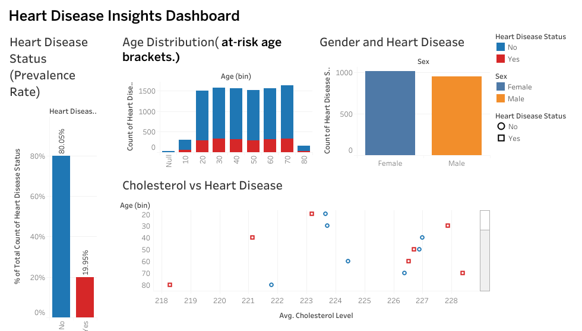

# Heart Disease Risk Dashboard

This Tableau dashboard explores heart disease patterns using a real-world dataset.  
It visualizes how age, cholesterol levels, and other factors relate to heart disease prevalence.

## Key Features:
- Cleaned and filtered cholesterol data (
- Interactive scatter plots showing risk trends
- Analysis by gender, age, and exercise habits

## Tools Used:
- Tableau
- Excel (pre-cleaning)
- GitHub for documentation

> Built with curiosity and a passion for health data
